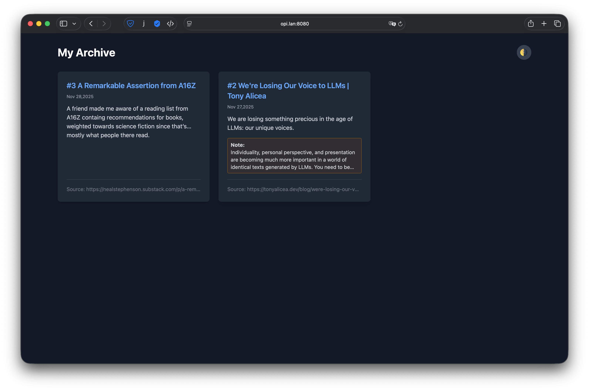
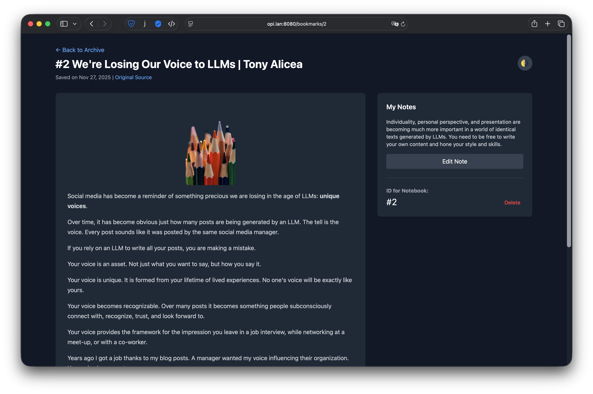
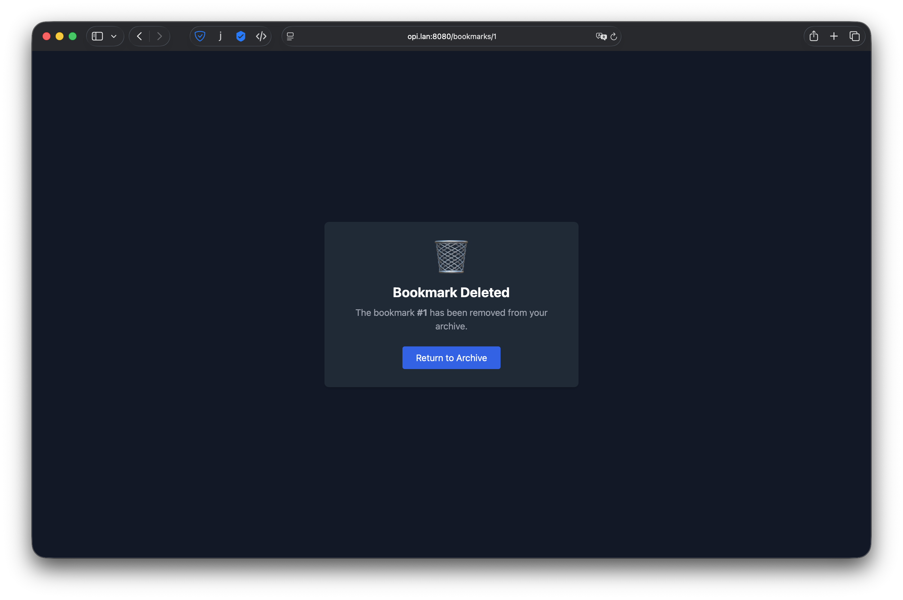

# Bookmarks Archive

A simple self-hosted service for archiving web pages with the ability to add notes and generate unique IDs for paper notebooks.

## Features

*   **Archive Content**: Saves the full content of articles locally (distraction-free).
*   **Notes**: Add personal comments/notes to bookmarks.
*   **Paper Notebook Friendly**: Generates a simple incremental ID (e.g., #42) to reference in physical notebooks.
*   **iOS Integration**: Save directly from iPhone via iOS Shortcuts.
*   **Dark Mode**: Optional dark theme for comfortable reading.
## Screenshots

|                             Dark Mode                              |
| :----------------------------------------------------------------: |
|      <br>_List View_      |
| <br>_Article View_ |
|       <br>_404_        |


## Getting Started

### Prerequisites

*   Go 1.21+ installed.

### Development

Run the server directly:

```bash
go run cmd/server/main.go
```

The server will be available at `http://localhost:8080`.

### Production Build & Run

To run the service in a production environment (e.g., on a VPS or Raspberry Pi):

1.  **Build the binary**:
    ```bash
    go build -o bookmarks-server cmd/server/main.go
    ```

2.  **Deployment**:
    Ensure the `web` directory (containing templates) is in the same folder as your binary. The structure should look like this:
    ```text
    /app
      ├── bookmarks-server
      └── web/
          └── templates/
              ├── index.html
              ├── detail.html
              └── ...
    ```

3.  **Run**:
    ```bash
    ./bookmarks-server
    ```

4.  (Optional) Use `systemd` or `Docker` to keep the service running in the background.

### Cross-compilation for Armbian (via Makefile)

If you want to build the application on your local machine (e.g., macOS) and deploy it to an Armbian device:

1.  **Run the release command**:
    ```bash
    make release-arm64
    ```
    This will create a `dist/bookmarks-server-linux-arm64.tar.gz` archive containing the compiled binary and the `web` directory.

2.  **Transfer to device**:
    Copy the archive to your device (e.g., via `scp`):
    ```bash
    scp dist/bookmarks-server-linux-arm64.tar.gz user@your-pi-ip:~/
    ```

3.  **Unpack and Run**:
    On the device:
    ```bash
    tar -xzvf bookmarks-server-linux-arm64.tar.gz
    cd bookmarks-server
    ./bookmarks-server
    ```

### Running on Armbian (Manual Setup)

Specific steps for setting up on an Armbian device (assuming ARM64 architecture):

1.  **Install Dependencies**:
    ```bash
    sudo apt update
    sudo apt install git -y
    ```

2.  **Install Go 1.23+**:
    ```bash
    wget https://go.dev/dl/go1.23.0.linux-arm64.tar.gz
    sudo rm -rf /usr/local/go && sudo tar -C /usr/local -xzf go1.23.0.linux-arm64.tar.gz
    echo 'export PATH=$PATH:/usr/local/go/bin' >> ~/.bashrc
    source ~/.bashrc
    ```

3.  **Clone the Repository**:
    ```bash
    git clone https://github.com/tiomat/bookmarks.git
    cd bookmarks
    ```

4.  **Build the Application**:
    ```bash
    go build -o bookmarks-server cmd/server/main.go
    ```

5.  **Setup Systemd Service** (for auto-start):
    Create the service file:
    ```bash
    sudo nano /etc/systemd/system/bookmarks.service
    ```

    Add the following configuration (adjust paths if you cloned elsewhere):
    ```ini
    [Unit]
    Description=Bookmarks Archive
    After=network.target

    [Service]
    User=root
    WorkingDirectory=/root/bookmarks
    ExecStart=/root/bookmarks/bookmarks-server
    Restart=always

    [Install]
    WantedBy=multi-user.target
    ```

6.  **Start the Service**:
    ```bash
    sudo systemctl daemon-reload
    sudo systemctl enable bookmarks
    sudo systemctl start bookmarks
    ```

## Usage

### Web Interface

Open `http://localhost:8080` in your browser to view archived articles, search, and edit notes.

### iOS Shortcut Setup

To save articles from your iPhone, create a new Shortcut in the "Shortcuts" app:

1.  **Input**: Set to "Receive Any" from "Share Sheet".
2.  **Action 1**: "Get URLs from Shortcut Input".
3.  **Action 2**: "Ask for Input" with text "Comment" (optional).
4.  **Action 3**: "Get Contents of URL".
    *   **URL**: `http://<YOUR_SERVER_IP>:8080/api/bookmarks` (Replace `<YOUR_SERVER_IP>` with your server's IP address).
    *   **Method**: POST
    *   **Request Body**: JSON
    *   **Add new field**:
        *   Key: `url`, Value: (Variable from Action 1 - URL)
        *   Key: `comment`, Value: (Variable from Action 2 - Provided Input)
5.  **Action 4**: "Get Dictionary Value".
    *   Get `Value` for key `id` from (Contents of URL).
6.  **Action 5**: "Show Notification".
    *   Text: "Saved as # (Dictionary Value)".

Now you can tap "Share" on any page in Safari, select this shortcut, add a note, and the article will be archived.

## Project Structure

*   `cmd/server`: Application entry point.
*   `internal/models`: Data structures.
*   `internal/storage`: SQLite database operations.
*   `internal/archiver`: Logic for downloading and cleaning HTML (uses `go-readability`).
*   `web/templates`: HTML templates.
